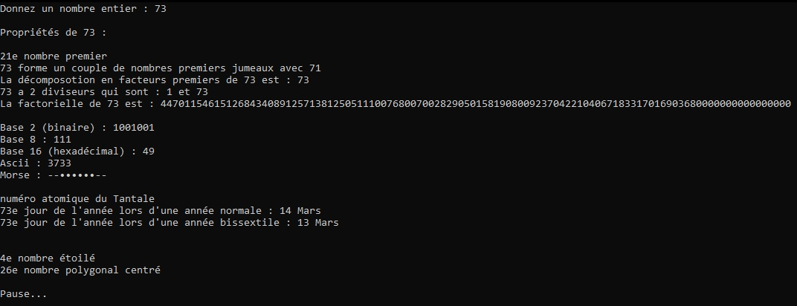

# Python-Number-Properties

This is a simple program that gives you several properties of a number you enter.
## Features
- Prime number
- Semi-prime number
- Pair of twin primes number
- Compound number
- Decomposition into prime factors
- Dividers
- Factorial
- Fibonacci number
- Base 2
- Base 8
- Base 16
- Ascii
- Morse
- Periodic table element
- Normal day of the year
- Leap year day
- Triangular number
- Perfect square
- Pentagonal number
- Hexagonal number
- Heptagonal number
- Octogonal number
- Enneagonal number
- Decagonal number
- Polygonal number
- Centered triangular number
- Centered square number
- Centered pentagonal number
- Centered hexagonal number
- Centered heptagonal number
- Centered octogonal number
- Centered enneagonal number
- Centered decagonal number
- Star number
- Centered polygonal number
## Installation
1. Download the repository by clicking on `Code > Download ZIP`
2. Extract the ZIP file
3. Run `main.py`
## Requirements
- Python 3.7
## Usage
After running the program, you just need to enter a number of your choice and let the program give you some information about it.